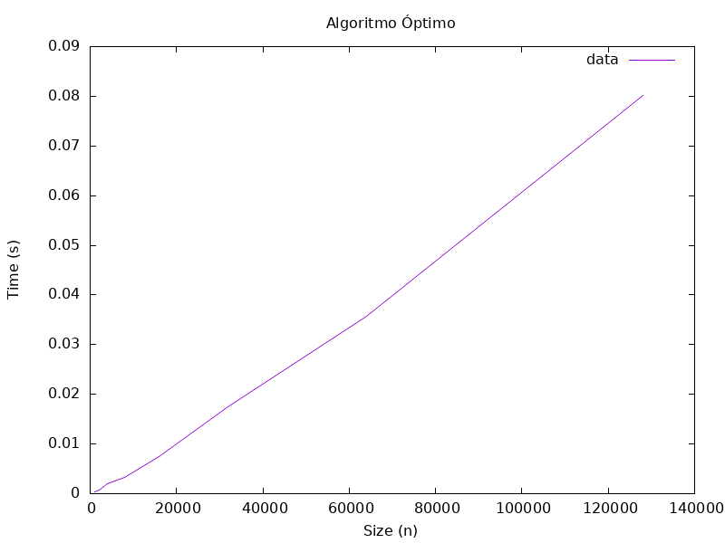
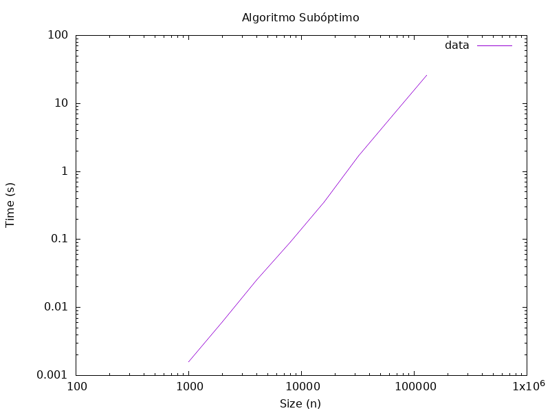
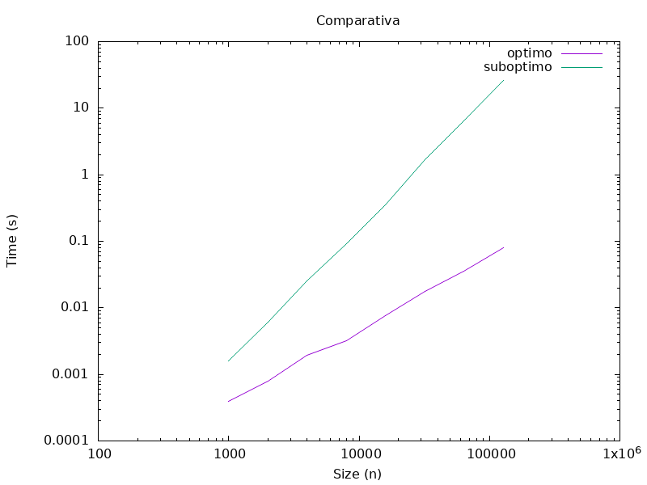

# Problema 1: Análisis Químico

## Enunciado

"Un técnico de laboratorio quiere averiguar la composición química de un asteroide. Para ello,
dispara láseres a distintas frecuencias al asteroide. Cada sustancia si de una lista de `n` posibles
sustancias constituyentes tiene un rango conocido $[l_i, h_i]$ en el que la sustancia reaccionaría al
láser (los rangos pueden estar solapados). El objetivo es elegir el conjunto más pequeño de
frecuencias `f1, . . . , fk` para que cada sustancia si reaccione a una de estas, es decir, para cada
`i = 1, . . . , n` hay al menos un `j` con $l_i \leq f_j \leq h_i$."

## Desarrollo de Algoritmo Óptimo

Según el enunciado del problema, nuestro objetivo es minimizar el número total de frecuencias (disparos láser) necesarias para hacer reaccionar un conjunto de sustancias. Dichas sustancias químicas están representadas por los intervalos de frecuencias $[l_i,h_i]$ de radiación electromagnética a la que reaccionan.

###  Definición del Flujo de Datos

Para acercarnos lo máximo posible a una situación del mundo real, partimos de la premisa de que los datos de entrada nos llegan desordenados. Por lo que recibiremos por referencia un `vector<pair<double,double>>` que representa la secuencia de intervalos de frecuencia, y un `vector<double>` vacío que guardará nuestra solución de secuencia de frecuencias mínimas. Quedándonos la siguiente cabecera para nuestra función principal:

`int minFrecuencias(const vector<pair<double,double>> &intervalos, vector<double> &frecuencias);`

### Lógica Principal del Algoritmo

#### Ordenamiento de los Datos

El primer paso que nos pareció obvio y necesario, sobre todo teniendo en cuenta que nos basamos en la técnica de diseño de algoritmo voraz, para tomar decisiones óptimas locales es ordenar estos datos. Si intentáramos encontrar las intersecciones a fuerza bruta sin un orden previo, la complejidad se dispararía. 
Con lo cual, delegamos este ordenamiento de la manera que nos pareció más elegante: un contenedor `set` inicializandolo de la siguiente manera:

`set<pair<double,double>> subconjuntos(intervalos.begin(), intervalos.end());`

El coste de insertar un elemento en un `set` es de $\log n$, por lo que al tener $n$ datos esta decisión de diseño establece directamente la cota mínima del orden de eficiencia de nuestro algoritmo en $O(n\log n)$. A partir de aquí, el procesamiento de los intervalos no superará esta complejidad.

#### La Esencia del Algoritmo: Búsqueda Voraz de Intersecciones. 

Nuestra estrategia principal se basa en que para minimizar los disparos, debemos agrupar la mayor cantidad de sustancias que compartan un rango de frecuencias válido y disparar en el punto límite que las satisfaga a todas.

##### Paso A: El bucle de Control de `minFrecuencias`

El núcleo del algoritmo principal es un bucle `while` que se ejecutará mientras queden sustancias por procesar en nuestro set. En cada iteración, delegamos la tarea pesada a nuestra función auxiliar `encuentraIntersecciones`, pasándole dos cosas por referencia:

1. Todo el conjunto de intervalos restantes: `set<pair<double,double>> &subconjunto`
2. Una `cota_sup` inicial, que siempre será el límite superior del primer intervalo que estamos evaluando en ese momento (`subconjuntos.begin()->second`).

Esta función nos devuelve la frecuencia exacta donde debemos disparar. La guardamos en nuestro vector de resultados `frecuencias` y el bucle repite el proceso con los intervalos que hayan sobrado.

##### Paso B: Encontrando Todas las Intersecciones de un intervalo `encuentraIntersecciones`

Esta función evalúa qué tantos intervalos consecutivos se solapan y calcula el punto exacto de disparo. Actúa de la siguiente manera:

- $\textbf{Caso Base:}$ Si en el conjunto queda menos de 2 elementos, significa que no hay nada más con qué comparar. Limpiamos el conjunto para romper el bucle principal y devolvemos la `cota_sup` actual. Esa es nuestra frecuencia de disparo.

- $\textbf{Caso Recursivo:}$ Si hay más elementos, tomamos un iterador al siguiente elemento en el set y comparamos su inicio con nuestra `cota_sup` actual. Aquí se nos abren dos caminos en función de la presencia o ausencia de intersecciones:

  - **En ausencia:** Si nuestra `cota_sup` es estrictamente menor que el inicio del siguiente intervalo (`cota_sup < siguiente->first`), significa que no el intervalo actual no tiene intersecciones con ningún otro intervalo al estar ordenados, por lo que sabemos que hemos encontrado nuestro límite. Borramos el elemento actual del set y devolvemos la `cota_sup` que traíamos.
  - **En presencia:** Si los intervalos sí se solapan, tenemos que asegurarnos de que nuestro disparo alcance a ambos. Para ello, actualizamos nuestra `cota_sup` tomando el mínimo entre esta y el límite superior del nuevo intervalo (`siguiente->second`).  Una vez ajustada la nueva cota más estricta, borramos el intervalo actual que acabamos de procesar y hacemos una llamada recursiva, pasando el set (ahora sin el primer elemento) y nuestra nueva `cota_sup` ajustada para que se compare con el siguiente de la lista.

### Notas Adicionales sobre Decisiones de Diseño

- $\textbf{Recursividad vs. Iteración en}$ `encuentraIntersecciones`: Decidimos implementar esta función de manera recursiva por mera elegancia resolutiva y legibilidad del código, siendo plenamente conscientes de que las pruebas no iban a tratar con conjuntos de datos extremos. Cabe recalcar, sin embargo, que de no haber sido el caso, tendríamos que haber diseñado la función de forma iterativa para evitar un posible $\text{Stack Overflow}$ causada por el apilamiento masivo en cada llamada recursiva.

- $\textbf{La elección de }$ `set` $\textbf{ frente a }$ `multiset`: Nos decantamos por inicializar un `set` clásico porque nos conviene eliminar los elementos repetidos desde el principio. En el contexto de nuestro problema, si hay dos o más sustancias con exactamente el mismo intervalo de reacción, basta con evaluar uno de ellos; procesar intervalos idénticos duplicados con un `multiset` no aportaría nada a la lógica de la búsqueda de intersecciones entre intervalos y solo nos haría gastar recursos.

### Demostración de Validez
Partimos de un conjunto de $n$ sustancias, cada una con un intervalo de reacción $I_i = [l_i, h_i]$. Queremos encontrar un conjunto mínimo de frecuencias $F = \{f_1, f_2, \dots, f_k\}$ tal que $\forall I_i, \exists$ al menos un $f_j \in I_i$.

#### Nuestro Algoritmo Voraz

Actualmente nuestro algoritmo ordena los intervalos de manera ascendente por su $l_i$, luego evalúa los intervalos solapados y coloca siempre el láser $f_1$ (primer disparo) en el valor más a la derecha posible de la intersección actual, siendo entonces $f_1 = \min(h_i)$ de los intervalos que se solapan.

#### Demostración por reducción al absurdo 

Sea $I_1 = [l_1,h_1]$ el intervalo más a la izquierda sin cubrir. Toda solución valida deberá disparar en algún $f \in [l_1,h_1]$ para cubrirlo.

- Nuestro algoritmo elige como punto de disparo $p^*$ el valor mínimo de los extremos derechos de los intervalos que se solapan en la iteración actual. Es decir, $p^* = \min \{h_i \mid I_i \in G\}$, siendo $G$ el conjunto de intervalos solapados.

Sea $S^*$ una solución optima que dispara en algún $p \in [l_1,h_1]$. Si $p \neq p^*$, construimos $S’$ reemplazando $p$ por $p^*$.

- Como $p*$ es el mínimo derecho del grupo, $p^* \leq h_1$, asi que $p^* \in [l_1,h_1]$
- Entonces todo $I_i = [l_i,h_i]$ cubierto por $p$ con $l_i \leq p \leq h_i$ satisface $l_i \leq p^* \leq h_i$ porque:
  - $l_i \leq p^*$: como el intervalo está en el grupo solapado, $l_i \leq$ cota_sup en algún paso.
  - $p^* \leq h_i:$ por definición, $p^*$ es el mínimo de los extremos derechos del grupo.

Por tanto, $S’$ cubre al menos lo mismo que $S^*$ con el mismo número de disparos. $|S’| = |S^*|$, luego nuestro algoritmo greedy no puede ser subóptimo.

## Desarrollo del Algoritmo Subóptimo

Tal y como establece el guion de la práctica, una vez implementado el algoritmo principal, debemos proponer y desarrollar una alternativa para poder compararlos.

La primera decisión que debemos tomar es el tipo de enfoque a utilizar. Optamos por mantener la filosofía voraz, pero aplicando un criterio de selección distinto al que ya teníamos desarrollado para observar cómo afecta esta decisión al resultado.

La idea fue simple: cambiar únicamente la estrategia de dónde disparar el láser. Mientras que el algoritmo anterior (el óptimo) evalúa las cotas superiores para disparar lo más a la derecha posible de la intersección, en este nuevo algoritmo (subóptimo) la decisión voraz será disparar exactamente al inicio de cada intervalo no cubierto.

Para ello hemos creado la función `int minFrecuenciasGreedySuboptimo(vector<pair<double, double>>& intervalos, vector<double>& frecuencias)`, la cual recibe la lista de los intervalos de las sustancias y un vector por referencia donde iremos insertando las frecuencias elegidas. Además, devuelve como entero el número total de disparos necesarios.

El primer paso del algoritmo es ordenar los intervalos por su inicio. Para conseguirlo, utilizamos la función `std::sort` definida en la librería `<algorithm>`. Esta función requiere que le indiquemos cómo debe ordenar los datos, por lo que hemos implementado la siguiente función para que compare:

```cpp
bool ordenarInicio(const pair<double, double>& a, const pair<double, double>& b){
    if(a.first == b.first){ // Si el primer componente es igual, miramos el segundo
        return a.second < b.second; 
    }

    return a.first < b.first;
}
```

Esta función auxiliar simplemente compara el primer elemento (el inicio del intervalo) de dos pares para devolver el menor. En caso de que ambos intervalos comiencen exactamente en el mismo punto, desempata evaluando el segundo elemento (el final del intervalo).

Una vez tenemos los datos ordenados, iteramos sobre cada uno de los intervalos. Para cada sustancia, debemos comprobar si alguna de las frecuencias que ya tenemos guardadas sirve para hacerla reaccionar. Si está cubierta, no hacemos nada; si, por el contrario, no existe ninguna frecuencia guardada que sirva para hacerla reaccionar, tomamos la decisión voraz y disparamos al principio del intervalo.

Toda esta lógica queda reflejada en el siguiente fragmento:

```cpp
for(const auto& intervalo : intervalos){
        bool alcanzado = false;
        
        // Vemos si tenemos una frecuencia que sirva
        for(int i = 0; i < frecuencias.size() && !alcanzado; i++){
            const auto& f = frecuencias[i];
            if(f >= intervalo.first && f <= intervalo.second) alcanzado = true;
        }

        // Si no lo hemos alcanzado con ninguna frecuencia, disparamos al inicio
        if(!alcanzado){
            frecuencias.push_back(intervalo.first);
        }
}
```

## Ánalisis de Eficiencia

### Algoritmo Voraz - Eficiencia Teórica (Óptimo)

Nuestro algoritmo comienza en la función `minFrecuencias`  donde introducimos `n` intervalos
en un `set<pair<double,double>>`. Internamente, C++ gestiona el `set` como un árbol binario de búsqueda
balanceado, por lo que la inserción de los `n` elementos tiene una eficiencia $O(n \log n)$.

Posteriormente, entramos en el núcleo del algortimo al realizar el bucle `while`, para analizarlo tendremos que 
ver qué hacemos dentro de la función `encuentraIntersecciones`. Dentro de dicha función, solo hacemos un 
`subconjunto.erase(subconjunto.begin())`, es decir, solamente usa un intervalo y lo elimina; eliminar el primer
elemento de un `set` tiene una eficiencia $O(\log n)$, por lo que si en el bucle `while` llamamos recursivamente 
para los $n$ intervalos, el coste de esta fase es $O(n) \cdot O(\log n) = O(n \log n)$.
Si sumamos el coste de la funcion `encuentraIntersecciones` con el coste de la inserción en el `set` nos queda que la 
eficiencia de nuestro algoritmo voraz es $O(n \log n) + O(n \log n) = \mathbf{O(n \log n)}$.

### Algoritmo Voraz - Eficiencia Teórica (Subóptimo)

Empezamos el análisis en la ordenación. En este caso hemos preferido usar `std::sort` para
ordenar por el inicio del intervalo. El coste estándar de hacer esta operación es $O(n \log n)$.

Posteriormente tenemos un doble bucle: 
```cpp
for(const auto& intervalo : intervalos){ 
        bool alcanzado = false;
        for(int i = 0; i < frecuencias.size() && !alcanzado; i++){
            const auto& f = frecuencias[i];
            if(f >= intervalo.first && f <= intervalo.second) alcanzado = true;
        }

        //push_back...
}
```

En el mejor de los casos, es decir, que los intervalos se solapen tanto que el vector de frecuencias se mantenga en tamaño 1, el bucle interno tendrá un coste constante $O(1)$, dejando el coste de recorrer todos los intervalos en $O(n)$.

Sin embargo, en el peor de los casos (donde ningún intervalo se solapa y el vector de frecuencias crece hasta tamaño $n$), el bucle interno iterará hasta el final en cada paso. Esto genera una suma aritmética que nos deja una complejidad cuadrática de $O(n^2)$.

Por lo tanto, si al coste de la ordenación le sumamos el coste del bucle anidado, nos queda que la eficiencia asintótica de este algoritmo es $O(n \log n) + O(n^2) = \mathbf{O(n^2)}$

### Análisis Empírico
Para el análisis empírico hemos decidido realizar una función `realizarEstudioEmpirico` que hará uso de las funciones
descritas a lo largo del desarrollo del problema. Para realizar las mediciones, hemos utilizado una clase auxiliar (que ya
hemos utilizado en prácticas anteriores) para tener acceso al reloj preciso del ordenador y así poder realizar las tomas
de tiempo. 

Como tenemos que analisar dos algoritmos de diferente eficiencia, hemos prefijado tamaños que se puedan adecuar a ambos, 
definiendo un vector de la siguiente forma: `vector<int> tams = {1000, 2000, 4000, 8000, 16000, 32000, 64000, 128000};`.
Además, para evitar ruidos del sistema, hemos preferido hacer `k` iteraciones para cada tamaño, para posteriormente realizar
la media. 

Una vez definida la función, los tamaños y el valor de k, hemos compilado y tomado los tiempos.

#### Análisis Empírico (óptimo)
Para el algoritmo óptimo hemos obtenido los siguientes tiempos: 

**Nota:** Véase el archivo `datosMemoria/algoritmoOptimo.dat` donde están todos los datos en bruto generados por el algoritmo.

| n | Tiempo |
| :--- | :--- |
| 1000 | 0.00039126 |
| 2000 | 0.000798587 |
| 4000 | 0.00193449 |
| 8000 | 0.0032115 |
| 16000 | 0.00754194 |
| 32000 | 0.0174643 |
| 64000 | 0.0356389 |
| 128000 | 0.0801229 |

A partir de los datos obtenidos, y utilizando la herramienta Gnuplot, hemos podido realizar la gráfica correspondiente:




En esta gráfica se representa el crecimiento del tiempo de ejecución del algoritmo óptimo (en escala lineal). Como se puede apreciar, el comportamiento del tiempo es extremadamente contenido; incluso al someter al algoritmo a una carga de 128.000 intervalos, el tiempo de procesamiento se mantiene por debajo de las 0.08 décimas de segundo, demostrando una altísima eficiencia en la práctica.

#### Análisis Empírico (Subóptimo)
Para el algoritmo subóptimo hemos obtenido los siguientes tiempos:

**NOTA:** Véase el archivo `datosMemoria/algoritmoSuboptimo.dat` donde están todos los datos en bruto generados por el algoritmo.

| n | Tiempo |
| :--- | :--- |
| 1000 | 0.0015957 |
| 2000 | 0.00608971 |
| 4000 | 0.0257527 |
| 8000 | 0.0925139 |
| 16000 | 0.352638 |
| 32000 | 1.69736 |
| 64000 | 6.50092 |
| 128000 | 25.9147 |

A partir de los datos obtenidos, y utilizando la herramienta Gnuplot, hemos podido realizar la gráfica correspondiente:



**NOTA:** En esta gráfica se ha empleado escala logarítmica.

A diferencia del algoritmo óptimo, esta gráfica refleja un crecimiento mucho más agresivo del tiempo de ejecución frente al aumento del tamaño de la entrada. Para la misma carga máxima de 128.000 intervalos, el algoritmo requiere casi 26 segundos en finalizar. 

#### Comparación Empírica




En la gráfica siguiente se presenta la comparativa empírica del tiempo de ejecución (en segundos) de ambos algoritmos en función del número de intervalos ($n$). Para facilitar la visualización de ambas curvas y apreciar sus órdenes de magnitud, se ha empleado una escala logarítmica en ambos ejes.
A partir de esta representación gráfica, podemos extraer conclusiones que respaldan directamente nuestro análisis teórico previo:

- Algoritmo Voraz Subóptimo (Línea verde): Muestra una pendiente pronunciada y constante. Tiene una mayor inclinación, lo que es el rasgo característico de una función polinómica de mayor grado, lo que corrobora visualmente nuestra cota teórica cuadrática de $O(n^2)$. El efecto es evidente: a medida que el tamaño de la entrada crece, el coste de cómputo se dispara debido a los bucles anidados.

- Algoritmo Voraz Óptimo (Línea morada): Presenta una pendiente mucho más suave. En la escala logarítmica, una complejidad de $O(n \log n)$ se asemeja a una recta con una pendiente cercana a 1. Como se observa en los datos empíricos, el algoritmo escala de manera excelente, resolviendo problemas de hasta 128.000 intervalos en apenas milésimas de segundo gracias a la eficiencia del árbol binario balanceado `(std::set)`.

\clearpage

## Conclusiones
Tras el análisis realizado sobre el problema del alineamiento de frecuencias láser, podemos extraer las siguientes conclusiones fundamentales:

- Eficacia de la Estrategia Voraz: Se ha demostrado, tanto de forma teórica como práctica, que el enfoque greedy es idóneo para este problema. Sin embargo, la clave del éxito reside en la elección del criterio de selección. Mientras que disparar al inicio de cada intervalo (algoritmo subóptimo) cumple con el objetivo de cubrir todas las sustancias, solo la búsqueda de la intersección máxima hacia el extremo derecho (algoritmo óptimo) garantiza el uso del número mínimo absoluto de disparos.

- Impacto de las Estructuras de Datos: La implementación del algoritmo óptimo mediante el uso de std::set (árboles binarios balanceados) ha resultado ser determinante. Esta decisión de diseño ha permitido mantener una complejidad de $O(n \log n)$, marcando una diferencia abismal frente al comportamiento cuadrático $O(n^2)$ del algoritmo subóptimo basado en vectores y búsquedas lineales.
