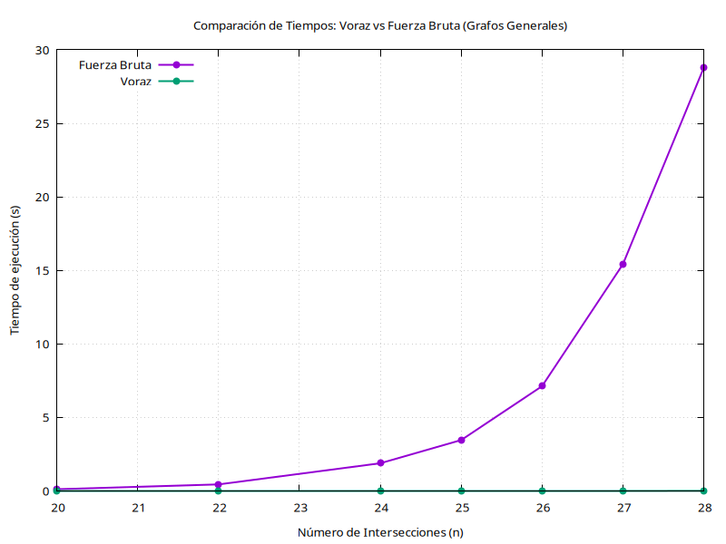
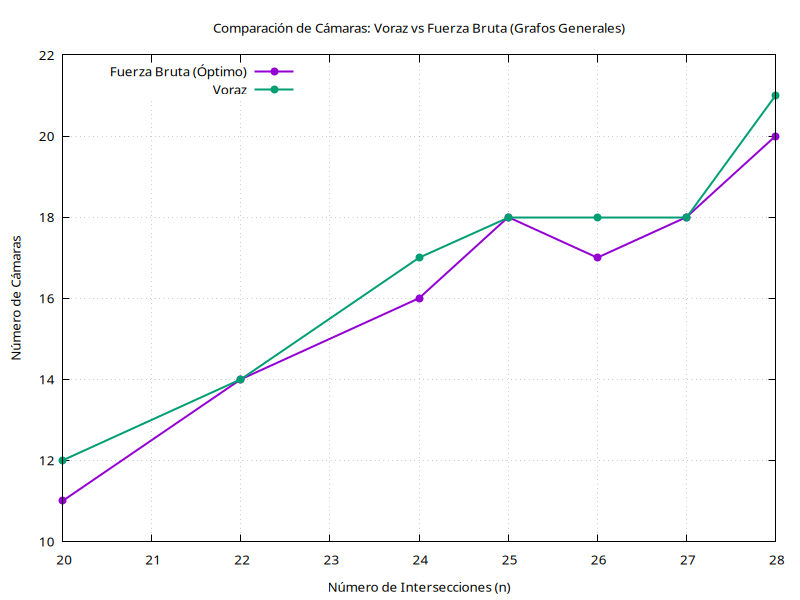
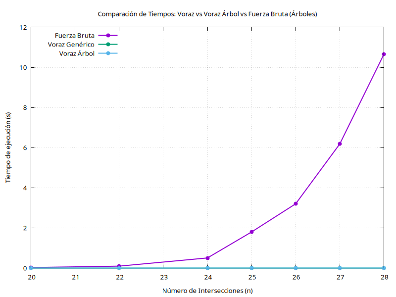
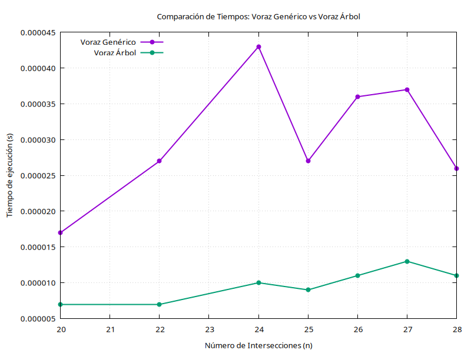
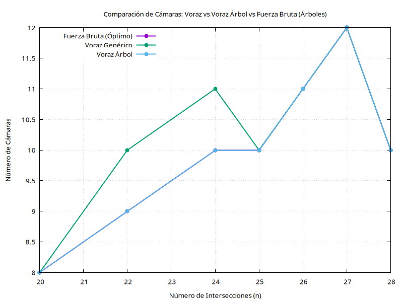

# Problema 2: Cámaras de Vigilancia

## Enunciado y Descripción del Problema

El objetivo fundamental de este problema es garantizar la seguridad de un complejo arquitectónico formado por una serie de intersecciones y pasillos. Para ello, partimos de la premisa de que una cámara de vigilancia colocada estratégicamente en una intersección es capaz de monitorizar todos los pasillos que convergen en ella.

Nuestra meta es encontrar la solución óptima absoluta. Cabe aclarar que, en el contexto de este problema, el término "óptimo" trasciende la mera eficiencia temporal del algoritmo (tiempo de ejecución); se refiere de manera prioritaria a la consecución de una disposición espacial que requiera instalar el número estrictamente mínimo de cámaras posibles para cubrir la totalidad del recinto.

## Planteamiento y División del Problema

Para poder abordar y analizar de forma exhaustiva la naturaleza del problema propuesto, hemos optado por bifurcar nuestro enfoque desarrollando dos soluciones diametralmente opuestas en su concepción:

1. $\textbf{Algoritmo Óptimo (Fuerza Bruta)}$
   - Garantiza la obtención de la solución óptima absoluta mediante la evaluación sistemática de todo el espacio de soluciones posibles.
   - Presenta la limitación inherente de un coste computacional extremadamente elevado, volviéndose inmanejable conforme la dimensión del problema escala.

2. $\textbf{Algoritmo Subóptimo (Voraz / Greedy)}$
   - Renuncia a la garantía matemática de hallar la solución óptima absoluta.
   - A cambio, ofrece tiempos de ejecución drásticamente inferiores frente a la fuerza bruta.
   - Garantiza alcanzar una solución "suficientemente buena" (una aproximación de alta calidad, muy cercana al óptimo real).

## Desarrollo del Algoritmo Óptimo (Fuerza Bruta)

### Lógica Principal del Algoritmo

El algoritmo de fuerza bruta se cimenta sobre la idea de explorar recursivamente todas las combinaciones posibles referentes a la colocación o no colocación de cámaras en cada una de las intersecciones disponibles.

El esquema de funcionamiento es el siguiente:
1. En la intersección actual bajo evaluación, tomamos una decisión binaria: colocar una cámara (1) o prescindir de ella (0).
2. Efectuamos una llamada recursiva hacia la siguiente intersección, ramificando el proceso para ambas decisiones.
3. Al alcanzar el caso base de la recursividad (cuando se han tomado decisiones para el conjunto total de intersecciones), procedemos a verificar mediante nuestra matriz de adyacencia si la combinación de cámaras propuesta es factible (es decir, si no deja ningún pasillo sin vigilar).
4. Si la combinación resulta ser válida y, además, mejora la cantidad de cámaras de la mejor solución registrada hasta el momento, procedemos a almacenarla como la nueva solución óptima provisional.

### Análisis de Eficiencia Teórica

El diseño de este algoritmo por fuerza bruta fracciona el problema general de tomar $n$ decisiones en 2 subproblemas de tamaño $n-1$, añadiendo un esfuerzo computacional constante en cada nodo del árbol recursivo. Definiendo el tamaño decreciente de la entrada como $m$, y estableciendo el inicio de la recursión en $m = n$ intersecciones restantes por evaluar, obtenemos la siguiente ecuación en recurrencia para el número de nodos:

$$T(m) = 2T(m-1) + c$$

Para resolver dicha ecuación, recurrimos a la $\textbf{ecuación característica}$:
1. Planteamos la recurrencia en su forma canónica: $T(m) - 2T(m-1) = c$
2. Buscamos la solución a la ecuación homogénea asociada ($T^{(h)}(m) - 2T^{(h)}(m-1) = 0$). Su polinomio característico es $r - 2 = 0$, que arroja una única raíz $r = 2$.
   Por consiguiente, deducimos que $T^{(h)}(m) = c_1 \cdot 2^m$.
3. A continuación, buscamos una solución particular para la constante $c$. Dado que 1 no constituye una raíz de la ecuación homogénea, proponemos $T^{(p)}(m) = c_2$.
   Sustituyendo en la original: $c_2 - 2c_2 = c \implies c_2 = -c$.
4. Ensamblando ambas partes, la solución general de nuestra recurrencia queda definida como:
   $$T(m) = c_1 \cdot 2^m - c$$

A la luz de estos resultados, comprobamos que el árbol de llamadas recursivas exhibe un crecimiento de orden $\mathcal{O}(2^n)$.
No obstante, al alcanzar las $2^n$ hojas del árbol (el escenario donde se han consumado las decisiones para los $n$ nodos, resultando en $m=0$), el algoritmo invoca la función de validación `Factiblefb()`. Esta rutina escudriña la mitad superior de la matriz de adyacencia en busca de aristas para verificar su cobertura, operación que conlleva un coste inherente de $\mathcal{O}(n^2)$.

Dado que este coste terminal se incurre $2^n$ veces, concluimos que la $\textbf{complejidad temporal asintótica del algoritmo de fuerza bruta es } \mathcal{O}(n^2 \cdot 2^n)$.

## Desarrollo del Algoritmo Subóptimo (Voraz)

### La Esencia del Algoritmo: Selección por Grado Máximo

Nuestra estrategia voraz abraza un enfoque heurístico: en cada iteración del proceso, la decisión óptima local consistirá en seleccionar siempre aquella intersección que sea capaz de abarcar la mayor cantidad de pasillos ciegos. En términos de grafos, esto se traduce en elegir invariablemente el nodo que ostente el mayor grado dentro de la submatriz restante.

El flujo de ejecución de la función principal `greedy()` es el siguiente:
1. Instanciamos una matriz auxiliar `aux` a la cual copiamos los datos originales, preservando así la integridad de la información inicial.
2. Iniciamos un bucle de control que persistirá en su ejecución mientras el sistema detecte pasillos desprovistos de vigilancia.
3. Se realiza un escaneo completo de la matriz para aislar la intersección con el mayor número de conexiones activas (el nodo de mayor grado).
4. Registramos dicha intersección como elemento constituyente de nuestra solución.
5. Procedemos a marcar como "vigilados" todos los pasillos incidentes a la intersección seleccionada (efectuando un borrado lógico de su correspondiente fila y columna en la matriz `aux`).

### Análisis de Eficiencia Teórica

Desglosando internamente el núcleo de la función `greedy()`, identificamos un bucle `while` que alberga tres operaciones fundamentales:

1. $\textbf{El bucle de control }$ `while`: En el escenario más desfavorable, nos veríamos obligados a instalar una cámara por cada intersección existente, limitando el número máximo de iteraciones a $n$.
2. $\textbf{Búsqueda de pasillos }$ `quedanPasillosSinVigilar(aux)`: Efectúa un barrido exhaustivo sobre la totalidad de la matriz $n \times n$ en busca de aristas remanentes, lo cual impone un coste de $\mathcal{O}(n^2)$.
3. $\textbf{Cálculo del máximo grado }$ `verticeMayorGrado(aux)`: Recorre íntegramente la matriz $n \times n$ para cuantificar las incidencias de cada vértice. Este proceso conlleva un coste de $\mathcal{O}(n^2)$.
4. $\textbf{Actualización de estado }$ `marcarPasillosVigilados(aux, índice)`: Invalida (asigna a $0$) todos los elementos pertenecientes a la fila y columna del vértice elegido, resultando en un coste lineal de $\mathcal{O}(n)$.

Agrupando los componentes iterativos, el coste computacional por cada ciclo asciende a $\mathcal{O}(n^2) + \mathcal{O}(n^2) + \mathcal{O}(n) = \mathcal{O}(n^2)$.
Al multiplicar este esfuerzo por la cota superior de iteraciones ($n$), determinamos que la $\textbf{complejidad temporal del algoritmo voraz se asienta en } \mathcal{O}(n^3)$.

## Análisis Empírico: Voraz vs. Fuerza Bruta (Grafos Generales)

Con el propósito de validar la viabilidad real de nuestro algoritmo Voraz y cuantificar su divergencia respecto a la solución Óptima absoluta, resulta imperativo someterlos a una confrontación empírica. 
Nuestro análisis teórico nos advierte que la Fuerza Bruta despliega un crecimiento exponencial $\mathcal{O}(n^2 \cdot 2^n)$, lo cual predice un punto crítico (alrededor de $n \approx 30$) donde la capacidad de cómputo colapsará impidiendo obtener una respuesta en un lapso razonable. En contraste, el comportamiento polinómico $\mathcal{O}(n^3)$ del Voraz le otorga la facultad de resolver configuraciones de miles de pasillos en ínfimas fracciones de segundo.

Para materializar esta comparativa y vislumbrar tanto el abismo temporal como el margen de suboptimidad de la heurística Greedy, hemos recopilado un conjunto de mediciones de campo que desglosamos a continuación.

### Tabulación de Resultados

Para la recolección de los datos empíricos, procedimos a compilar nuestro código fuente en C++ (`camaras-fb.cpp`), prestando especial atención a la habilitación de los correspondientes flags de optimización del compilador. El banco de pruebas se ha alimentado empleando el generador automático de grafos integrado en el propio código, barriendo el espectro de tamaños desde $n=20$ hasta $n=28$ intersecciones.

El protocolo para cada instancia evaluada fue el siguiente:
- Se sintetizó una matriz de adyacencia aleatoria, manteniendo constante la probabilidad de inserción de aristas.
- Se cronometró y registró el desempeño de la función `greedy()`, anotando tanto su tiempo de ejecución como la cantidad de cámaras dictaminadas.
- Acto seguido, se replicó el mismo proceso de medición para la llamada a la función óptima `fb_recursivo(0)`.

| Intersecciones ($n$) | Cámaras (Voraz) | Cámaras (Fuerza Bruta) | Tiempo Voraz (s) | Tiempo Fuerza Bruta (s) |
|:---:|:---:|:---:|:---:|:---:|
| **20** | 12 | 11 | 0.000089 | 0.1118 |
| **22** | 14 | 14 | 0.000134 | 0.4398 |
| **24** | 17 | 16 | 0.000228 | 1.8788 |
| **25** | 18 | 18 | 0.000183 | 3.4564 |
| **26** | 18 | 17 | 0.000189 | 7.1207 |
| **27** | 18 | 18 | 0.000236 | 15.4157 |
| **28** | 21 | 20 | 0.000511 | 28.7832 |

De la atenta lectura de esta tabla, podemos destilar conclusiones reveladoras:
1. La estrategia Voraz es capaz de impactar con éxito en la solución óptima en repetidas ocasiones; sin embargo, adolece de una tendencia a sobredimensionar la infraestructura instalando entre 1 y 2 cámaras superfluas al enfrentarse a grafos de notable complejidad.
2. Resulta demoledor observar cómo, para un modesto escenario de $n=28$, la Fuerza Bruta consume la friolera de casi 29 segundos de procesamiento. Simultáneamente, el algoritmo Voraz resuelve el mismo dilema en unos irrisorios 0.000511 segundos. Constituye un argumento empírico irrefutable a favor del empleo de heurísticas voraces al lidiar con la intratabilidad de los problemas NP-Completos en entornos reales.

A modo de refuerzo experimental y para ampliar nuestro espacio muestral, adjuntamos a continuación una segunda batería de pruebas ejecutada en el equipo de nuestro compañero Fran:

| Intersecciones ($n$) | Cámaras (Voraz) | Cámaras (Fuerza Bruta) | Tiempo Voraz (s) | Tiempo Fuerza Bruta (s) |
|:---:|:---:|:---:|:---:|:---:|
| **20** | 11 | 11 | 0.000221 | 0.2004 |
| **22** | 15 | 15 | 0.000371 | 0.5047 |
| **24** | 16 | 16 | 0.000420 | 1.9274 |
| **25** | 16 | 16 | 0.000376 | 3.8893 |
| **26** | 18 | 18 | 0.000515 | 7.5035 |
| **27** | 19 | 18 | 0.000563 | 16.850 |
| **28** | 19 | 18 | 0.000552 | 32.495 |

La corroboración es evidente: en los umbrales de $n = 27$ y $n = 28$, la heurística voraz prescribe 19 cámaras, rebasando el óptimo absoluto de 18. Queda atestiguado, por tanto, que la heurística no detenta la infalibilidad absoluta.
Paralelamente, presenciamos la materialización de la explosión combinatoria, observando un tiempo de ejecución que se amolda a nuestras proyecciones previas (superando la barrera de los 30 segundos para $n = 28$).
Por su parte, la latencia del algoritmo Voraz se mantiene imperturbable en el orden de los microsegundos, haciendo gala de una eficiencia técnica excepcional.
Podemos dictaminar firmemente que nuestro algoritmo sacrifica una fracción verdaderamente nimia de precisión resolutiva como tributo para alcanzar una contracción asombrosa en los tiempos de cómputo.

### Representación Gráfica (Grafos Generales)

## Desarrollo de Optimización Específica para Árboles (Voraz)

Es de vital importancia matizar que la variante algorítmica que se expone a continuación ha sido concebida de manera exclusiva para operar sobre grafos acíclicos conexos (árboles). Su aplicación sobre grafos de carácter general, susceptibles de contener ciclos en su topología, derivará en comportamientos anómalos y resoluciones incorrectas. Por esta razón de peso, las representaciones gráficas del epígrafe anterior circunscriben su comparativa al Algoritmo Voraz Genérico frente a la Fuerza Bruta. En la presente sección, someteremos a escrutinio a la tríada de algoritmos de manera estricta bajo el dominio de los árboles.

Nuestra aproximación voraz refinada para árboles basa su modus operandi en el rastreo de nodos hoja (vértices de grado uno). Una vez localizada una hoja, la heurística toma la decisión irrevocable de emplazar la cámara en el vértice progenitor (el nodo padre). Esta maniobra táctica asegura irremediablemente la cobertura del nodo hoja, de su padre, así como de cualesquiera otros nodos hermanos o ascendientes directos del padre, maximizando el área de influencia de cada dispositivo.

El diagrama de flujo de este mecanismo se detalla a continuación:
1. Generamos una matriz auxiliar `aux` clonando la matriz origen, protegiendo así nuestro modelo de datos.
2. Instanciamos un bucle iterativo que mantendrá la ejecución activa en tanto pervivan pasillos ciegos no vigilados.
3. Penetramos la matriz mediante una exploración focalizada en identificar una hoja, de la cual, acto seguido, derivamos su nodo ascendiente (el padre).
4. Anexionamos dicho nodo padre a nuestro sumatorio de la solución final.
5. Sancionamos como "vigilados" todos los tramos adyacentes a esta nueva instalación, materializando este paso mediante la purga sistemática de la fila y columna pertinentes en la matriz `aux`.

### Análisis de Eficiencia Teórica (Voraz en Árboles)

Incursionando en las entrañas de la función `greedyArbol()`, discriminamos el siguiente desglose de operaciones:
1. $\textbf{Bucle de ejecución }$ `while`: Conservando el patrón del voraz genérico, se restringe a un máximo de $n$ iteraciones.
2. $\textbf{Auditoría de pasillos }$ `quedanPasillosSinVigilar(aux)`: Ejecuta una lectura integral de la matriz, reportando un coste de $\mathcal{O}(n^2)$.
3. $\textbf{Localización de hojas }$ `BuscamosHoja(aux)`: Explora el espacio matricial tabulando el grado de conexión de cada intersección. Su ejecución se interrumpe prematuramente devolviendo el nodo padre en el instante en que halla una incidencia de grado uno. En el umbral del peor de los casos, obligaría a procesar la matriz completa, implicando una penalización de $\mathcal{O}(n^2)$.
4. $\textbf{Consolidación }$ `marcarPasillosVigilados(aux, padre_hoja)`: Anula, mediante reasignación a $0$, los componentes ortogonales del vértice afectado. Coste: $\mathcal{O}(n)$.

Al cristalizar el coste iterativo, nos topamos con la expresión $\mathcal{O}(n^2) + \mathcal{O}(n^2) + \mathcal{O}(n) = \mathcal{O}(n^2)$.
Considerando la frontera superior de $n$ iteraciones, inferimos que la $\textbf{complejidad temporal asintótica del algoritmo se preserva en } \mathcal{O}(n^3)$, manteniendo la paridad teórica con su homólogo genérico. Pese a ello, como comprobaremos a continuación, la empiria demuestra que esta variante goza de una velocidad de ejecución ligeramente superior; fenómeno atribuible a la parada temprana de la función `BuscamosHoja`, la cual elude la onerosa necesidad de escrutar el grafo en su totalidad, exigencia insoslayable para la función `verticeMayorGrado`.

### Análisis Empírico sobre Árboles

Para llevar a cabo una disección comparativa del desempeño de nuestra tríada algorítmica (Fuerza Bruta, Voraz Genérico y Voraz Específico para Árboles), hemos recurrido al módulo generador de grafos acíclicos integrado en nuestro software.

| Intersecciones ($n$) | Cámaras (Voraz Genérico) | Cámaras (Voraz Árbol) | Cámaras (Fuerza Bruta) | Tiempo Voraz Genérico (s) | Tiempo Voraz Árbol (s) | Tiempo FB (s) |
|:---:|:---:|:---:|:---:|:---:|:---:|:---:|
| **20** | 8 | 8 | 8 | 0.000017 | 0.000007 | 0.023677 |
| **22** | 10 | 9 | 9 | 0.000027 | 0.000007 | 0.092646 |
| **24** | 11 | 10 | 10 | 0.000043 | 0.000010 | 0.500536 |
| **25** | 10 | 10 | 10 | 0.000027 | 0.000009 | 1.795116 |
| **26** | 11 | 11 | 11 | 0.000036 | 0.000011 | 3.198420 |
| **27** | 12 | 12 | 12 | 0.000037 | 0.000013 | 6.182430 |
| **28** | 10 | 10 | 10 | 0.000026 | 0.000011 | 10.649700 |

Del minucioso escrutinio de la tabla de recolección de datos, emergen certidumbres irrefutables:
1. El $\textbf{Algoritmo Voraz Específico para Árboles converge invariablemente hacia la solución óptima absoluta}$. Sus dictámenes en cuanto al número de cámaras se alinean con precisión milimétrica frente a los veredictos de la Fuerza Bruta para todas las instancias evaluadas. Este hito es especialmente destacable en aquellos escenarios (como $n=22$ y $n=24$) donde la heurística del Voraz genérico flaqueó, prescribiendo infraestructura excedente.
2. En lo concerniente a los tiempos de cómputo, se constata que la $\textbf{variante voraz especializada en árboles resulta consistentemente más veloz}$ que la implementación voraz genérica (oscilando entre márgenes del doble e incluso el triple de velocidad procesal). Esta aceleración es fruto directo de la optimización táctica mencionada con anterioridad, que permite la ruptura anticipada del bucle de búsqueda tras el hallazgo de la primera hoja disponible.

### Representación Gráfica (Árboles)

## Conclusiones

Tras el profundo análisis ejecutado sobre el problema de la distribución de cámaras de vigilancia, nos encontramos en disposición de enunciar las siguientes conclusiones fundamentales:

- $\textbf{Eficacia y Necesidad de la Estrategia Voraz:}$ Ha quedado demostrado empírica y teóricamente el colapso inminente de los algoritmos de búsqueda exhaustiva ante problemas de esta naturaleza. La aproximación heurística (Greedy) se erige no como una mera alternativa, sino como la única vía pragmática para abordar el problema en escalas de dimensión real, permutando una fracción asumible de exactitud por una escalabilidad computacional formidable.
- $\textbf{El Valor de la Especialización Topológica:}$ La comparativa final nos brinda una lección de incalculable valor sobre la importancia del diseño algorítmico contextualizado. Al explotar una propiedad geométrica intrínseca de los grafos de entrada (la aciclicidad de los árboles), hemos logrado forjar una variante voraz capaz de proporcionar soluciones matemática y estrictamente óptimas, batiendo además en velocidad a su predecesor genérico. Esto nos subraya que una heurística cuidadosamente entonada a las propiedades de los datos es capaz de rivalizar con la perfección teórica de la fuerza bruta sin heredar sus limitaciones.
