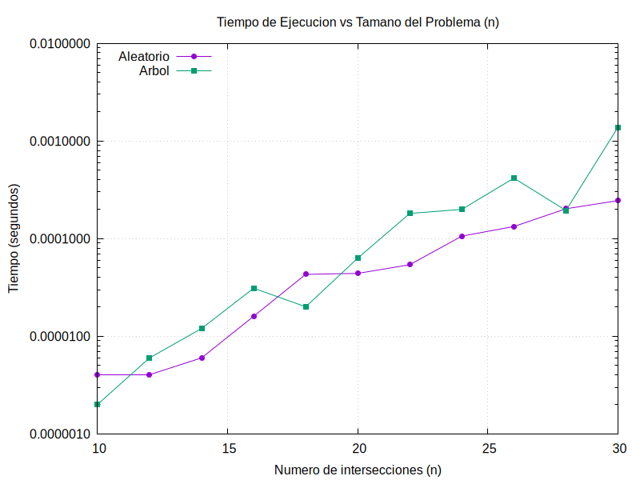
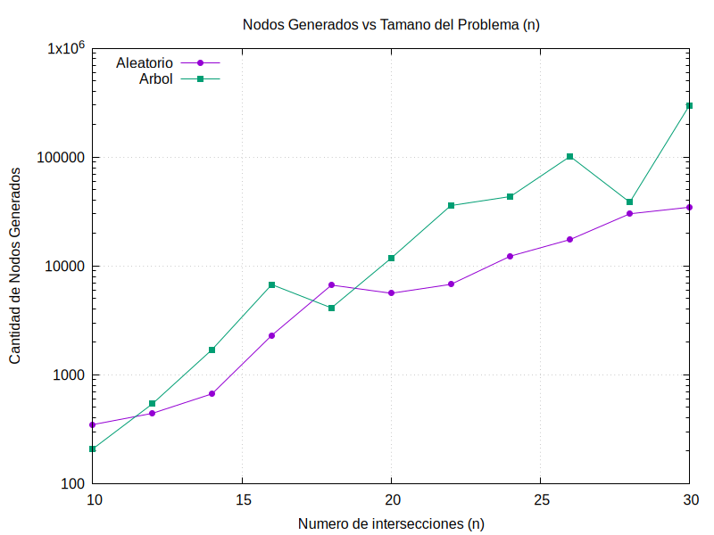
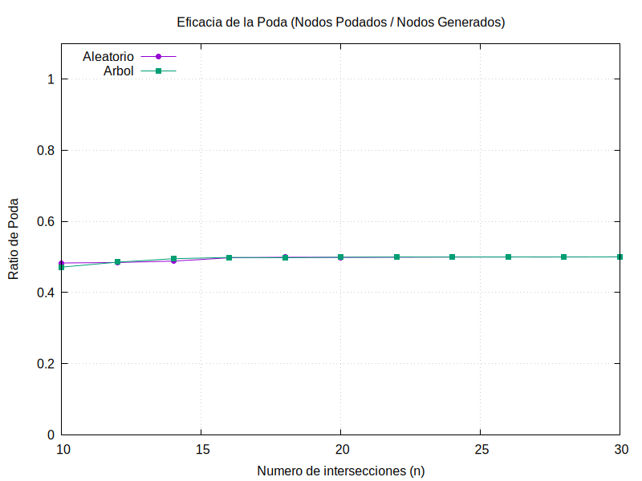

# Problema 2

## Enunciado
Se desea garantizar la seguridad de un complejo mediante la instalación de cámaras de vigilancia. Cada intersección entre pasillos está numerada del 1 al n, y se conoce también el conjunto de pasillos que unen intersecciones mediante pares (i, j), del pasillo que une la intersección i con la intersección j. Una cámara instalada en una intersección puede vigilar todos los pasillos que llegan a ella. Por ejemplo, si existen 7 intersecciones y 7 pasillos (1, 2),(1, 3),(3, 4),(3, 5),(4, 6),(5, 6),(6, 7), entonces colocar cámaras en las intersecciones {1, 3, 6} nos permite tener todos los pasillos vigilados (también si instalamos las cámaras en las intersecciones {1, 4, 5, 7}, por ejemplo). El objetivo es conseguir instalar el menor número posible de cámaras de modo que todos los pasillos estén vigilados por, al menos, una cámara.

## Representación

### Representación del Problema
El problema es representado mediante un grafo, donde las intersecciones son los vertices y los pasillos son las aristas. En el código esto lo representaremos con una matriz $n \times n$, donde n es el número de intersecciones.
En el código la matriz está definida como ``vector<vector<int>> m``. Cada casilla ``m[i][j]`` es igual a 1 si existe un pasillo directo entre la intersección i y la intersección j, y es igual a 0 si no lo hay. La diagonal de la matriz siempre será 0 porque una intersección no tiene pasillo a sí misma.

### Representación de la Solución
Backtracking: La solución la almacenamos en un ``vector<int> X`` de tamaño n. Cada posición del vector corresponde una intersección específica, si el valor una posición es 1 es que ha colocado una cámara en esa intersección, si es 0 no se coloca cámara y si es -1 aún no se ha decidido.

Ramificación y Poda: La solución la almacenamos en ``struct NodoB`` que está compuesto por el vector de decisiones que usamos en el problema de backtraking ``vector<int> X``, también tenemos un entero ``k`` para representar el nivel de profundidad actual en el árbol (el índice de la intersección evaluada), un entero ``camaras_colocadas`` para saber el número de camaras instaladas y el entero ``cota_estimada`` para almacenar el valor heurístico optimista del nodo, usado para ordenar la cola con prioridad.

Se habrá llegado a una solución completa cuando el nivel de exploración alcance el valor $k = n$, indicando que el vector de decisiones $X$ está lleno.

## Restricciones del Problema
### Restricciones Explícitas
Estas reglas son dictadas por el propio enunciado del problema, ya que hacen referencia a la física del problema. Entonces, nosotros hemos concluido las siguientes restricciones explícitas:
- Decisión binaria de instalación: Al evaluar una intersección solo existen dos posibilidades, o se instala una cámara en la intersección o se decide no instalarla.

### Restricciones Implícitas
Las restricciones implícitas son aquellas condiciones lógicas que garantizan la coherencia y validez de los estados generados. Para asegurar la correcta ejecución de la búsqueda, en este problema debemos garantizar el cumplimiento de las siguientes dos reglas:
- Todos los pasillos deben estar vigilados por al menos una cámara. En nuestra representación, si existe un pasillo que conecta la intersección $i$ con la intersección $j$ (m[i][j] == 1), es incorrecto que ambas intersecciones carezcan de cámara simultáneamente ($X[i] == 0$ y $X[j] == 0$).
- Si tomamos la decisión de no colocar una cámara en una intersección, debemos verificar hacia atrás. Si hay alguna intersección anterior, conectada con k, en la que se no se conectó cámara, el movimiento se considerará inválido. Ya que ese pasillo quedaría sin vigilar, haciendo imposible que sea una solución correcta.

## Árbol de Exploración
El árbol de búsqueda de nuestro algoritmo se va generando de forma dinámica a medida que avanzamos en la evaluación de las intersecciones. Este árbol de decisión contiene los siguientes elementos:
- Raíz: Representa el estado inicial antes de asignar ninguna cámara. El vector ``X`` tiene todas las posiciones a -1 y nos ubicamos en ``k = 0``.
- Nodos: Cada nodo del árbol en un nivel k es el instante en el que el algoritmo debe tomar una decisión para la intersección.
- Ramas / Hijos: Se genera un árbol binario por lo que de cada nodo salen como máximo 2 hijos. O se decide instalar cámara o no se instala.
- Hojas: Son los nodos finales a los que se llega cuando la exploración llega al nivel k=n. Cuando ya se ha decidido sobre todas las intersecciones.

Como cada nodo interno del árbol puede generar hasta 2 hijos, el tamaño del árbol crece de forma exponencial. En el peor de los casos, el número total de hojas a evaluar sería $2^n$. Es decir, la complejidad espacial y temporal teórica es de órden $\mathcal{O}(2^{n})$. Por ello, es necesario emplear mecanismos para descartar ramas.

## Justificación y Contraejemplo del Algoritmo Voraz
Se han implementado técnicas de búsquedad exacta debido a que los algoritmos voraces utilziados en etapas anteriores no garantizan la obtención de la solución optima global. El enfoque voraz basado en seleccionar siempre la intersección con mayor número de pasillos puede tomar decidio es que obliguen a instalar más cámaras de las necesarias.

### Contraejemplo
Imaginemos un grafo con 7 nodos: un nodo central C conectado a 3 nodos intermedios(N1,N2,N3). A su vez, cada nodo intermedio está conectado a un único nodo exterior(L1,L2,L3).
El algoritmo voraz elegiría primero el nodo C por tener el grado más alto(3). Al hacerlo, quedan sin vigilar los pasillos exteriores(N1,L1),(N2,L2) y (N3,L3). Para cubrirlos se ve obligado a instalar 3 cámaras más en los nodos hoja. En total, el voraz instala 4 cámaras.

Sin embargo, la solución óptima consiste en ignorar el centro y colocar cámaras directamente en los nodos intermedios(N1,N2,N3). Estos 3 nodos vigilan el nodo central y también sus respectivas hojas. En total, la solución óptima instala sólo 3 cámaras.

## Backtracking (vuelta atrás)
### Explicación del algoritmo:
Para el algoritmo de Vuelta Atrás empleamos una estrategia de búsqueda en profundidad (DFS). De forma recursiva, el algoritmo avanza nivel a nivel en el árbol de exploración. En cada nivel k (intersección concreta), algoritmo siempre intenta primero la rama donde se instala la cámara (X[k] = 1) y posteriormente, mediante el backtracking, explora la rama donde no se instala (X[k] = 0).

Para minimizar el coste, tenemos un variable mejorvalor_va que se encarga de almacenar el menor número de cámaras encontrado hasta el momento. Por su parte, la función recursiva de búsquedad recibe como par
ametros el nivel actual de exploración k, el número de camaras_colocadas en la rama actual y el vector de decisiones X.

### Función de Factibilidad
Para evitar la exploración de subárboles que llegan a soluciones inválidas, hemos implementado la función factible(k, X). Esta función la usamos cuando se decide no colocar cámara. Consiste en mirar hacia las intersecciones ya procesadas. Si detecta que existe un pasillo directo entre una intersección previa y la actual, y verifica que en esa intersección tampoco se colocó una cámara, la función devuelve ``false`` indicando que no es factible esa rama. Ya que ese pasillo quedará sin vigilancia.
### Podas aplicadas:
El algoritmo implementa dos mecanismos de poda fundamentales para descartar subárboles:
- Poda por factibilidad: Al evaluar la rama de no colocar cámara (X[k] = 0), se invoca a la función de factibilidad explicada anteriormente. Si el estado es clasificado como no factible, el algoritmo aborta la generación y exploración de esa rama.
- Poda por optimalidad: el algoritmo evalúa continuamente el número de cámaras que ya se han instalado en la rama actual. Si este valor es mayor o igual al valor de la mejor solución completa encontrada hasta el momento, entonces cualquier solución de esa rama no será mejor que la que ya tenemos. Por lo que se poda esa rama.

## Ramificación y Poda (Branch and Bound)
### Explicación del algoritmo:
el algoritmo de Ramificación y Poda en lugar de la recursividad, hace uso de una cola con prioridad que almacena y ordena los nodos válidos o que hay que explorar. La extracción de nodos se hace priorizando el nodo que tiene una mejor estimación de coste. Al extraer un nodo, se generan sus dos posibles hijos (poner o no poner cámara) y, si superan los filtros de poda, se insertan de nuevo en la cola de prioridad. Este proceso continúa hasta que la cola queda vacía.
### Cotas utilizadas:
Para ordenar la cola y descartar ramas, es necesario definir un sistema de cotas:
- Cota Local Optimista: A cada nodo del árbol se le asocia un valor heurístico cota_estimada. En nuestra implementación, esta cota equivale al número de cámaras que ya han sido colocadas en la ruta desde la raíz hasta dicho nodo. Es una cota optimista porque asume un escenario ideal en el que no es necesario instalar más cámaras.
- Cota Global: Al igual que en la técnica anterior, mantenemos el registro de la mejor solución válida encontrada hasta el momento mediante la variable global ``mejorvalor_ryp``.
### Podas aplicadas:
- Poda en generación (Factibilidad): como en el backtraking, al generar el nodo hijo de no instalar cámara, se evalúa su viabilidad mediante la función de factibilidad. Si no es factible, el nodo ni siquiera llega a ser insertado en la cola con prioridad.
- Poda en extracción: Después de extraer el mejor nodo de la cola con prioridad, se compara su ``cota_estimada`` con la cota global (``mejorvalor_ryp``). Si la cota local del nodo es mayor o igual a la cota global, significa que este nodo no podrá mejorar la solución que ya conocemos. Por tanto, el nodo es descartado.

## Verificación de Optimalidad(Fuerza Bruta)
Para asegurar que nuestros algoritmos de Backtracking y Ramificación y Poda están bien programados, hemos validado sus resutlados comparándolos con el algortimo de Fuerza Bruta en casos pequeños.
En todas las ejecuciones, los tres métodos han devuelto exactamente el mismo número mínimo de cámaras. Esto nos vonfirma que nuestras funciones de poda y las reglas que hemos usado para decidir si un pasillo está vigilado y no eliminan por error ninguna solución que pudiera ser la mejor. 

## Estudio empírico
Para el estudio empírico hemos optado por evaluar el rendimiento del algoritmo de Backtracking aplicando el problema de las cámaras de seguridad variando diferentes parámetros:

- La variable independiente: El tamaño del problema, que representa el número de intersecciones. El rango de valores evaluados ha sido desde n=10 hasta n=30 incrementando de 2 en 2.

- Las topologías: Para evaluar el verdadero impacto de la densidad de las conexiones hemos comparado 2 estructuras de grafos:
  - Aleatorio: Grafos generados con una probabilidad de arista $p=0.3$.
  - Árbol: Grafos conexos y dispersos con exactamente n-1 aristas.

- Variables dependientes: Serán el tiempo de ejecución del algoritmo en segundos, la cantidad de nodos generados y los nodos podados.

### Análisis de la Complejidad Temporal y Espacio de Búsqueda
En primer lugar, evaluamos la complejidad temporal y el tamaño del árbol de búsqueda en función del número de intersecciones, n.

La gráfica de $Tiempo de Ejecución$ vs $n$ obtenida ha sido la siguiente:

Vemos una tendencia recta ascendente. Esto confirma que la complejidad temporal y el crecimiento del árbol de exploración tienen un compotamiento exponencial $O(2^n)$ para el peor de los casos.

Aun así se puede observar como para n <= 30 se obtienen tiempos de ejecución menores de milisegundos ($\approx 0.001$ segundos), demostrando una eficiencia considerable.

### Impacto de la Topología
Los resultados nos muestran una fuerte dependencia entre la desidad del grafo y el redimiento general del algoritmo. 

La topología tipo "Árbol" genera sistemáticamente un orden de magnitud más de nodos y consume un tiempo de ejecución mayor frente a la topología "Aleatoria".

Esta diferencia radica en la función de factibilidad. Un grafo tipo árbol posee escasas ramificaciones cruzadas. Al evaluar la rama de decisión donde no se coloca una cámara, la probabilidad de dejar un pasillo adyacente sin vigilancia temporal es baja, lo que permite al algoritmo profundizar más en el árbol de recursión antes de detectar una inconsistencia. Por el contrario, en grafos aleatorios más densos, las intersecciones tienen más conexiones; no colocar una cámara genera violaciones de factibilidad en niveles muy superiores del árbol, lo que activa la poda temprana y reduce drásticamente el espacio de exploración.

### Eficiencia de la poda
La métrica de la poda muestra que el algoritmo estabiliza rápidamente su tasa de descarte en un valor muy cercano a $0.5(50%)$ constante para ambas topologías a medida que $n$ crece.

Es un comportamiento esperado, por cada llamada recursiva se generan 2 nodods hijos. La poda recae de forma exclusiva sobre la rama correspondiente a la decisión de no colocar cámara, descartando en promedio 1 de las 2 opciones generadas. Esto garantiza que el árbol sea muy pequeño conparandolo con el espacio de soluciones teóricas posibles.

